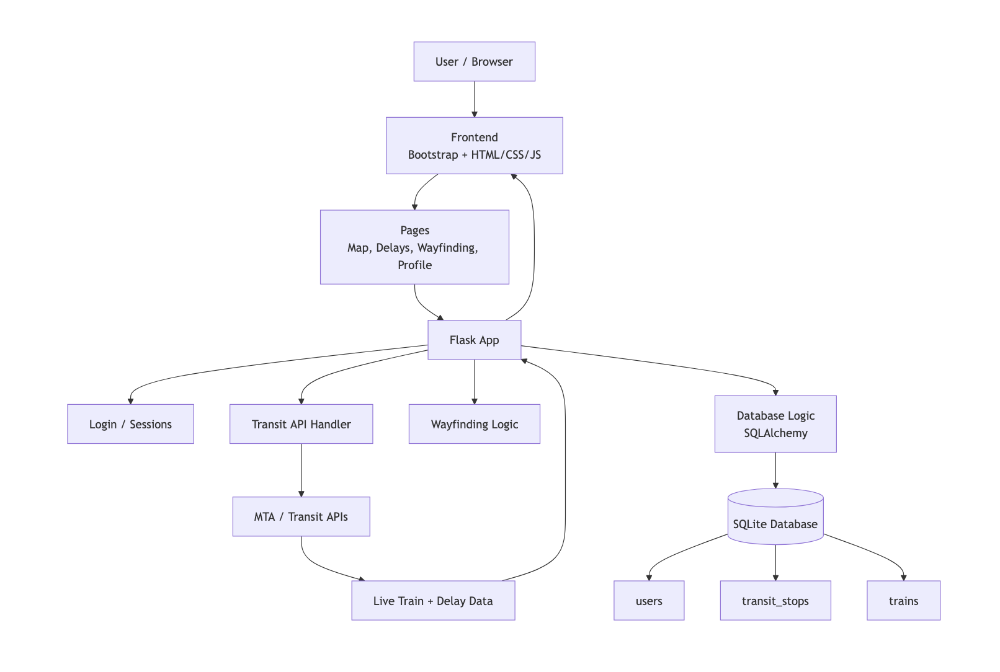
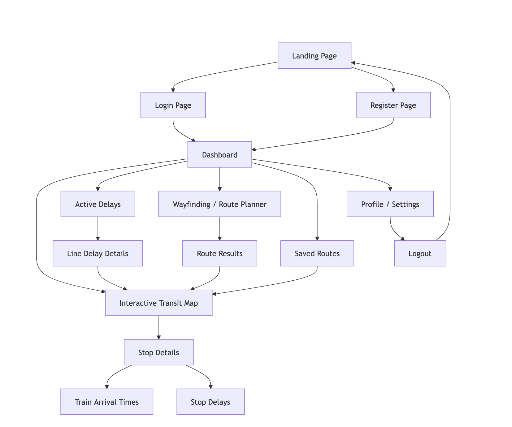
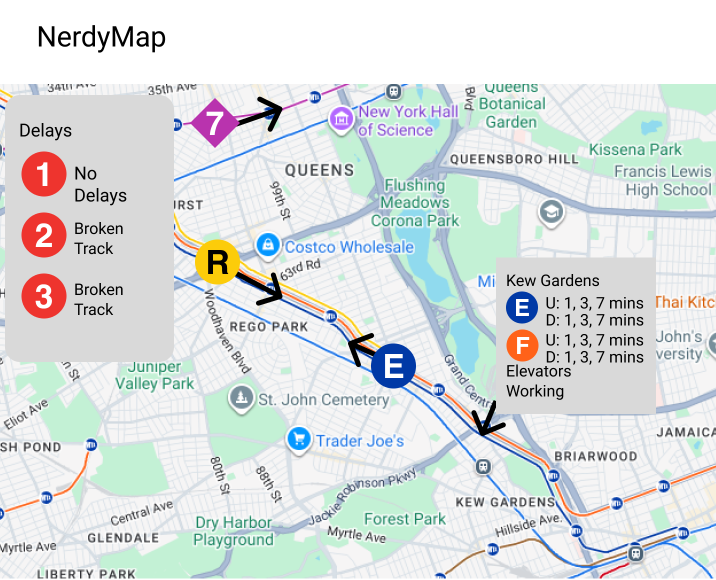

# System Blueprint (_a.k.a._ "Design Doc")

## TNPG: SARDines
## project: NerdyMap
## Target ship date: {2026-06-01}

---

#### roster:

| Name | Email | Primary Role | Secondary Role |
|---|---|---|---|
|Rohan Sen |rohans33@nycstudents.net |PM |Backend |
|David Lee |davidl542@nycstudents.net |F Student (Innovator)|Trailblazer |
|Sean Zheng |seanz22@nycstudents.net |F Student (Innovator) |Trailblazer |
|Araf Hoque |aoanulh2789@nycstudents.net |D Student |Ladies' Man |

---

# Summary
A one-stop shop for frequent nyc commuters, or in other words, a multi-purpose transit system guide targetting city folks.

## Problem Being Solved
Simple transit maps provided by apps such as Google or Apple Maps provide limited functionality and are often delayed in updating and timing. We are solving this limited functionality through incorporating visualization of trains' live positions, more interactivity, and more specific details. 

## Target Users

Who will use this system?
- People who utilize public transportation
- People who like cool maps

## Why This Project Matters
Many transit applications such as those integrated into Google/Apple Maps are often unreliable and inaccurate for some unknown reason (they don't disclose what metrics they use to time the arrivals/departures, i.e. ghost trains, etc.); we want to provide a stable, structured way to deliver transit times to users.

---

# Minimum Viable Product (MVP) Scope

## Core Features (Required for Final Submission)
Features that **must** be completed:
1. An interactive map showcasing transit routes in a given area, with realtime train positions mapped (NYC)
2. List of active delays across the city
3. Wayfinding between different stops

## Stretch Features (Only if MVP is Complete)
1. Add LIRR Support
2. Customizeable Interface (Pin lines, change UI parameters, etc)
3. Map changes based on delays

## Explicit Non-Goals
We don't want to recreate Google/Apple Maps. Our intent is to develop a more in-depth transit map, rather than just a clone. We'll have real-time delay information pinned to the side of the screen, a live map of subway trains moving around the city, and more detailed stats for each station/train (crowding, speed, elevator status, etc).

Features intentionally excluded:
- Multiple cities being integrated, since we want to focus on NYC's needs specifically and its unique system

---

# Technology Stack

| Layer | Selected Tool |
|---|---|
| Backend Framework | Flask |
| Frontend Framework | bootstrap |
| Database | SQLite |
| Authentication | Flask sessions |
| ORM / DB Library | SQLAlchemy |

## Why This Stack Was Chosen
We chose this stack because it matches our team’s experience and project needs. Flask is powerful enough to handle routes, API requests, sessions, and transit data without being too complex. Bootstrap helps us quickly build a clean, responsive interface using pre-styled components. SQLite works well because we have more experience with it than MongoDB, and it can store data like users, saved stops, pinned routes, and preferences. Flask sessions support basic login and user-specific features, while SQLAlchemy helps us connect our Python code to the database in a cleaner and more organized way. Overall, this stack lets us focus on building NerdyMap’s transit features instead of spending too much time learning unfamiliar tools.

---

# Team Ownership Plan

Each member must own meaningful deliverables.

| Team Member | Primary Ownership | Secondary Ownership | Specific Deliverables |
|---|---|---|---|
| Rohan Sen | Frontend (transit map anims) | Backend (transit API integration) | Get the transit map of NYC up and running, toggle options |
| David Lee | Backend (transit API integration) | Frontend (UI/UX) | Get data pipeline up and running, backend to frontend comms |
| Sean Chen | Backend (any other API integrations) | Frontend (UI/UX) | Along with David, get API integrations running |
| Araf Hoque | Frontend (transit map) | Frontend (UI/UX) | Help Rohan on transit map animations (has prior exp from personal passion project), help on frontend too |

---

# Component map

# Site map

# Mockup

## Key User Stories
### eg0
As a nerd, I want to watch the trains move around the map so that I can see the city moving around in real-time.

### eg1
As a New Yorker, I want to see where my train is so that I know how long I have to wait in the station, since the time estimates aren't as accurate.

### eg2
As a parent, I would want to track a specific train so that I can watch my kids come home and prepare for them to do so.

# APIs (pending)
## MTA
https://api.mta.info/#/subwayRealTimeFeeds
https://api.mta.info/#/serviceAlerts
https://api.mta.info/#/EAndEFeeds
## Google Maps
https://developers.google.com/maps/documentation/javascript/overview
https://developers.google.com/maps/documentation/routes/transit-route

# Database Design
## users
|DATA_TYPE|VAR_NAME|KEY_STATUS|NOTES|
|---|---|---|---|
|TEXT|username|PK|unique identifier of user|
|TEXT|password|||
|DATE|creation_date|||
|TEXT|saved_routes||routes user's saved/favorited|

## transit_stops
|DATA_TYPE|VAR_NAME|KEY_STATUS|NOTES|
|---|---|---|---|
|TEXT|stop_name|PK|unique identifier of transit stop|
|TEXT|possible_trains||all possible trains that can stop here|
|TEXT|stopped_trains||status of trains currently stopped here|
|TEXT|directions||direction of train stopped (uptown/downtown), corresponds w/ stopped_trains|
|TEXT|delays||any delays relayed by API calls|

## trains
|DATA_TYPE|VAR_NAME|KEY_STATUS|NOTES|
|---|---|---|---|
|TEXT|train||what train line it is|
|INT|train_id||considering dupes of trains|
|TEXT|arrival_times||arrival times for this specific train|
|TEXT|departure_times||departure times for this specific train|
|TEXT|delays||delays for this line (overall) or train in specific (running behind schedule)|

# Testing Plan
- Have members from other teams test our transit map animations, get feedback for client-side before near-final deadine so we can tweak and adjust
- Rigorously test UI/UX for different screens and dimensions so the animations are not buggy on diff. devices (especially transit map); important to make UI/UX not stagnant on the singular windows dim. we're working on
- Ensure API calls on both dev and user ends work so it doesn't magically break during demos, etc. by testing multiple times before, during, and after changes to codebase (A/B testing)

# Timeline
## Week 1 Goals: Basic map functionality, pull data from the MTA and other APIs.
## Week 2 Goals: Plotting trains on the map, rendering their movement, use websockets.
## Week 3 Goals: UI perfection, debugging, hopefully no major features pending.
## Internal Deadlines:
- Determine all the APIs we need (5/15/26)
- Have API keys, test calls set up (5/18/26)
- Basic map functionality up on frontend (5/22/26)
- More complex and detailed functionalities/tools up on frontend (5/25/26)
- Catch-up week on any functionalities that need more work or incomplete (5/29/26)
- Work on UI/UX to make it intuitive and easy to work with (5/29/26)
- Expand to other cities (BIG IF: 5/30/26 - deadline)

# Completion Criteria (_a.k.a._ "Definition of 'Done'")
Project is considered complete when all of the following are true:
1. Transit map of NYC is fully interactable and viewable of transit disruption panel, destination tracking/steps
2. API calls work 24/7 whenever service is called upon to use, doesn't take too long to load each call
3. Frontend UI/UX is intuitive and easy to work with for users, not just the devos who made the service.

# Open Questions
- Will we try to implement multiple cities? Presumably, if we can implement NYC transit tracking, we could for other cities, too.

# Appendix
None at the moment.

# Other
None at the moment.
